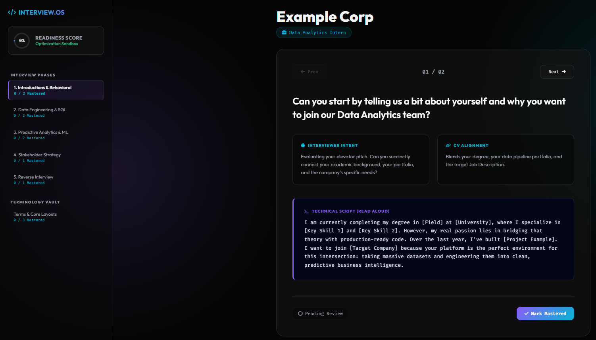

# 🚀 Interview.OS

**Interview.OS** is a local, offline Python pipeline that generates beautiful, interactive interview preparation dashboards from a simple JSON file.

Instead of juggling messy Google Docs or static spreadsheets, this tool compiles your target job description, portfolio alignment, and technical terminology into a self-contained "Neon Glassmorphism" Single Page Application (SPA). It runs entirely locally in your browser—no servers, no subscriptions, no internet required.

<div align="center">
  
  <p><i>Generated interactive dashboard featuring Active Recall tracking and the Terminology Vault.</i></p>
</div>

## ✨ Features

- **Zero Dependencies:** Written entirely in standard Python. No external libraries needed.
- **Dynamic Active Recall UI:** Features a categorized sidebar, tracking counters, and "Mark as Mastered" toggles to lock in your memory.
- **Terminology Vault:** A dedicated section to study complex technical definitions and learn how to drop them naturally into conversation.
- **100% Offline & Private:** Your data never leaves your machine. The output is a single `.html` file.

---

## 🛠️ Quick Start Guide

### 1. Clone the Repository

```bash
git clone https://github.com/thanhan25/interview-os.git
```

### 2. Generate the Template Dashboard Instantly

You don't need to write any JSON to see it in action. A pre-filled template is included. Run the Python compilation script from the root directory, passing in a target company, role, and the template JSON:

```bash
python generate_prep.py --company "Example Corp" --role "Data Analytics Intern" --data "data/interviews/template_example.json"
```

### 3. Launch the Application

The script generates a standalone HTML file inside the `documents/targets/` directory, labeled with the current year/month and company name. Open it directly in any modern web browser!

**Windows (PowerShell):**

```powershell
Start-Process .\documents\targets\2026-06-example-corp\prep_dashboard.html
```

Mac/Linux:

```bash
open documents/targets/$(date +%Y-%m)-example-corp/prep_dashboard.html
```

## 🏗️ Data Schema (How to write your JSON)

When you are ready to prepare for a real interview, duplicate the `data/interviews/template_example.json` file. Name it after your target company (e.g., `google.json`, `stripe.json`).

Your input JSON file must contain two root arrays: `"questions"` and `"glossary"`. The dashboard will automatically group your questions by the `category` string provided.

```json
{
  "questions": [
    {
      "category": "1. Data Engineering & SQL",
      "question": "How do you optimize query performance for large datasets?",
      "intent": "Testing SQL performance tuning knowledge.",
      "alignment": "Ties to your work with B-Tree indexing.",
      "response": "I optimize relational layers by applying strategic B-Tree indexing on frequently queried columns to prevent full-table scans..."
    }
  ],
  "glossary": [
    {
      "term": "B-Tree Indexing",
      "definition": "A self-balancing search tree data structure that maintains sorted data.",
      "why_they_ask": "To check if you understand computational efficiency.",
      "conversational_script": "To prevent downstream reporting lag, I engineered structured relational layers with B-Tree indexing..."
    }
  ]
}
```

## 🤝 Contributing

Feel free to fork this repository, tweak the CSS UI inside `generate_prep.py`, or expand the JSON parsing logic. Pull requests are welcome!

## ☕ Support the Project

If this tool helped you crush your technical interview and land the job, consider supporting the project! Your donations keep this tool alive and continuously improving.

[](https://paypal.me/thanhan25)


<a href="https://www.buymeacoffee.com/thanhan25" target="_blank"></a>


*(Alternatively, you can star the repository—it helps just as much!)*

## 📜 License

MIT License - Free to use, modify, and share.
